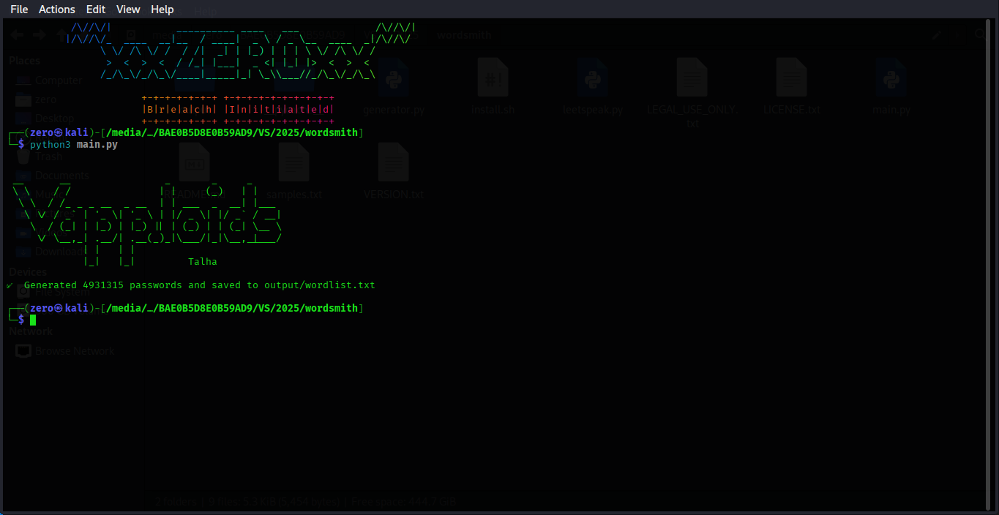

# 🔐 Wordsmith – Smart Password Wordlist Generator for Cybersecurity

**Wordsmith** is a Python-based tool that generates smart, realistic password wordlists using base words, leetspeak mutations, numbers, symbols, and years — inspired by `rockyou.txt`.



---

## 🚀 One-Line Install

```bash
curl -L https://raw.githubusercontent.com/talhatariq708/wordsmith-password-generator/main/install.sh | bash


wordsmith          # to generate the wordlist
wordsmith-update   # to get the latest version
